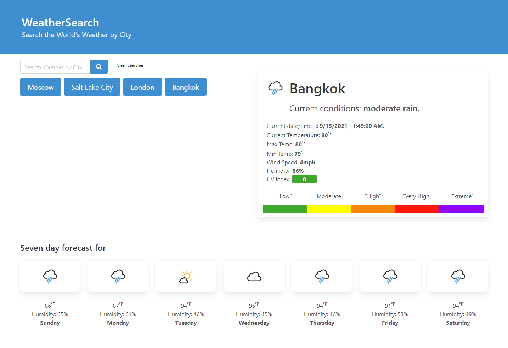

<h1 align="center">Weather Search</h1>

A simple app to search weather by city using Open Weather API for weather, Position Stack for obtaining latitude and longitude from user city-search input.

## Demo

> Live site demo: [_Weather Demo_](https://brandon-stewart-rgb.github.io/el-weather/). 

### Technologies Used

        * HTML
        * Javascript
        * Jquirey 
        * CSS
        * Gitbash
        * Github
        * Gitpages
        * GoFullPage
        * Visual Studio Code 
        * Bulma

### API's Used

[Open Weather API](https://openweathermap.org/api) 
[Abstract API](https://www.abstractapi.com/time-date-timezone-api) 
[PositionStack API](https://positionstack.com) 
[Google Fonts API](https://fonts.google.com/)
       
       
#### License      

 

 

#### Screenshot
  

#### Questions 
Contact: *Brandon Stewart*  
[My Github account](https://github.com/brandon-stewart-rgb)
