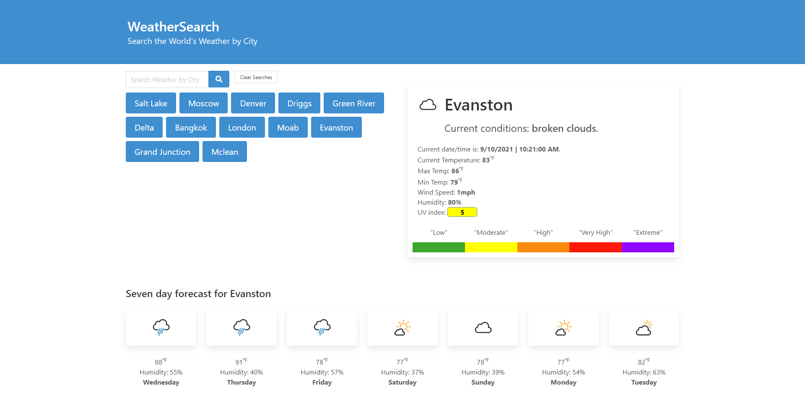

# weather search

A simple app to search weather by city using Open Weather API for weather, Position Stack for obtaining latitude and longitude from user city-search input.

## Demo

> Live site demo: [_Weather Demo_](https://brandon-stewart-rgb.github.io/el-weather/). 

### Technologies Used

        * HTML
        * Javascript
        * Jquirey 
        * CSS
        * Gitbash
        * Github
        * Gitpages
        * GoFullPage
        * Visual Studio Code 
        * Bulma
        * Google Fonts 

### API's Used

       * [_Open_Weather_API_](https://openweathermap.org/api)
       * [_Abstract_API_](https://www.abstractapi.com/time-date-timezone-api)
       * [_PositionStack_API_](https://positionstack.com)
       
       

#### License      

 

 

#### Screenshot
  

